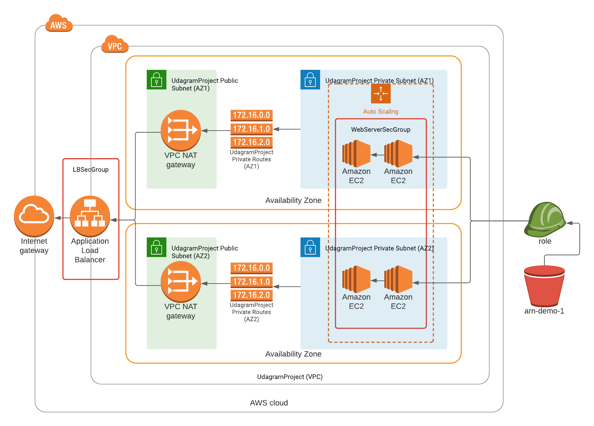

# Deploy a high-availability web app using CloudFormation

## Problem
Your company is creating an Instagram clone called Udagram.  
Developers pushed the latest version of their code in a zip file located in a public S3 Bucket.  
  
You have been tasked with deploying the application, along with the necessary supporting software into its matching infrastructure.  
  
This need to be done in an automated fashion so that the infrastructure can be discarded as soon as the testing team finishes their tests and gathers their results.

## Server specs
You'll need to create a **Launch Configuration** for your application servers in order to deploy four servers, two located in each of your private subnets. The launch configuration will be used by an auto-scaling group.  
  
You'll need two vCPUs and at least 4GB of RAM. The Operating System to be used is Ubuntu 18. So, choose an Instance size and Machine Image (AMI) that best fits this spec.
Be sure to allocate at least 10GB of disk space so that you don't run into issues.

